# KOKI — Keeps Ollama Kinda Intelligent

> **K.O.K.I.** (**K**eeps **O**llama **K**inda **I**ntelligent) is an autonomous, local-first AI assistant and evolutionary problem solver built with **Tauri v2 (Rust)**, **Next.js 15 (React 19 / TypeScript)**, and persistent **Neo4j Graph Memory**.

KOKI implements the **NVIDIA AVO (Agentic Variation Operators)** architecture — replacing standard linear single-pass LLM prompts with an autonomous evolutionary search loop managed by a **Supervisor Agent**, dynamic **Sub-Agents**, and a persistent **Neo4j Lineage Graph**.

---

## ⚡ Key Features

- **NVIDIA AVO Autonomous Variation Loop**: Continuous evolutionary loop (**Inspect Context** $\rightarrow$ **Plan** $\rightarrow$ **Mutate/Generate Candidate** $\rightarrow$ **Ground in Environment** $\rightarrow$ **Evaluate Score** $\rightarrow$ **Commit to Lineage**).
- **Supervisor Agent Orchestration**: Monitors trajectory across iterations, detects plateaus and stagnation, injects `SupervisorHint` interventions, and directs execution.
- **Dynamic Sub-Agent Spawning**: Spawns specialized agents on-demand:
  - 📋 **Planner Agent**: Deconstructs goals into structured multi-step variation plans.
  - 🛠️ **Variation Worker Agent**: Proposes and mutates code, shell commands, and tool calls.
  - ⚖️ **Evaluator Agent**: Objectively scores candidate outcomes against execution feedback.
  - 🩺 **Diagnoser Agent**: Pinpoints failure root causes and generates targeted repairs.
- **Persistent Neo4j Graph Memory**: Maintains the full evolutionary DAG in Neo4j via native async Bolt protocol (`neo4rs`), linking Tasks, Candidates, Evaluations, Supervisor Hints, and Sub-Agent runs with relationship edges (`MUTATED_FROM`, `EVALUATED_BY`, `GUIDED`, `SPAWNED_AGENT`).
- **Grounding in Environment & Rich Native Tools**: Sub-millisecond OS automation including mouse/keyboard control, screen capture, terminal shell execution, Playwright headless browser navigation, filesystem operations, and system telemetry.
- **Local-First Privacy & Low Footprint**: Native Rust core uses minimal system memory, keeping GPU VRAM dedicated to your local Ollama LLMs.
- **Modern Next.js App Router UI**: Responsive desktop workspace with light/dark themes, model selector, tool execution inspector, live hardware telemetry, and real-time Neo4j status indicator.

---

## 🏗️ Architecture Overview

```
KOKI/
├── docker-compose.yml             # Neo4j 5 Community instance with APOC plugins
├── src-tauri/                     # Native Rust Backend (Tauri v2)
│   ├── Cargo.toml                 # Dependencies (tauri, neo4rs, tokio, reqwest, enigo, etc.)
│   ├── tauri.conf.json            # Desktop window and build configurations
│   ├── capabilities/              # Tauri IPC security capabilities
│   └── src/
│       ├── lib.rs                 # Tauri initialization & command registry
│       ├── main.rs                # Native binary entrypoint
│       ├── models.rs              # Rust data models (AVO, Neo4j, Lineage, System)
│       ├── agent/
│       │   ├── mod.rs             # AgentEngine root & module exports
│       │   ├── avo_loop.rs        # NVIDIA AVO evolutionary search loop
│       │   ├── graph_memory.rs    # Neo4j Graph Memory Manager (Bolt / Cypher)
│       │   ├── supervisor.rs      # Supervisor Agent (stagnation & trajectory monitor)
│       │   ├── subagents.rs       # Dynamic Sub-Agent spawner & role runners
│       │   └── tools.rs           # Native tools (OS, Shell, Playwright, Filesystem)
│       └── commands/
│           ├── agent_cmds.rs      # Agent IPC commands (ask_assistant, check_neo4j_status, etc.)
│           └── system_cmds.rs     # Telemetry & Ollama IPC commands
│
├── src/                           # Frontend (Next.js 15 App Router)
│   ├── app/
│   │   ├── layout.tsx             # Root layout with QueryProvider and theme tokens
│   │   ├── page.tsx               # Main assistant multi-view dashboard
│   │   └── globals.css            # Standardized theme design tokens (light & dark)
│   ├── components/
│   │   ├── ui/                    # Reusable UI primitives (Button, Card, Input, Badge)
│   │   ├── chat/                  # ChatInterface, MessageBubble, ChatInput, ToolCallCard
│   │   ├── agent/                 # ModelPicker, ToolInspector, SystemMonitor, SettingsView
│   │   └── layout/                # Header, Sidebar, ThemeToggle
│   ├── lib/
│   │   ├── api.ts                 # Centralized Axios client instance
│   │   ├── tauri.ts               # Safe Tauri IPC invoker with browser fallback
│   │   ├── utils.ts               # Styling & formatting helpers
│   │   └── types.ts               # Strict TypeScript interfaces
│   ├── store/
│   │   ├── useAppStore.ts         # Zustand store for UI & configuration state
│   │   └── useChatStore.ts        # Zustand store for chat messages & streaming state
│   └── providers/
│       └── QueryProvider.tsx      # TanStack React Query provider
│
├── package.json                   # Frontend dependencies (managed via pnpm)
├── next.config.ts                 # Next.js static export config (output: 'export')
├── tailwind.config.ts             # Tailwind CSS token definitions
└── tsconfig.json                  # Strict TypeScript configuration
```

---

## 🛠️ Technology Stack

| Component | Technology | Description |
| :--- | :--- | :--- |
| **Agent Architecture** | **NVIDIA AVO** | Evolutionary variation loop with supervisor orchestration |
| **Graph Database** | **Neo4j 5** | Persistent knowledge graph & solution lineage tracking |
| **Graph Driver** | **neo4rs** | Native async Bolt protocol connector in Rust |
| **Desktop Shell** | **Tauri v2** | Lightweight native webview wrapper with secure IPC |
| **Backend Engine** | **Rust (Tokio)** | Async concurrency, system tools & streaming event bridge |
| **Frontend Framework**| **Next.js 16** | App Router static export (`output: 'export'`) |
| **UI Library** | **React 19** | Component-driven declarative UI |
| **Styling** | **Tailwind CSS** | Design token system with light and dark mode support |
| **Client State** | **Zustand** | UI preferences, active sessions, and streaming buffers |
| **Server State** | **TanStack Query** | Async caching, Neo4j status polling & Ollama model lists |
| **HTTP Client** | **Axios** | Centralized API client with interceptors |
| **Package Manager** | **pnpm** | Fast, disk-efficient package management |

---

## 📋 Prerequisites

1. **Node.js**: v18+ (v22 recommended)
2. **pnpm**: `npm install -g pnpm`
3. **Rust & Cargo**: [rustup.rs](https://rustup.rs/) (Rust 1.78+)
4. **Ollama**: [ollama.com](https://ollama.com/) (running local models)
5. **Docker**: (for running the Neo4j graph database container)

---

## 🚀 Getting Started

### 1. Clone & Install Dependencies

```bash
# Navigate to project directory
cd KOKI

# Install frontend dependencies using pnpm
pnpm install
```

### 2. Start the Neo4j Graph Database

Start the persistent Neo4j instance using Docker Compose:

```bash
docker compose up -d
```

- **Neo4j Browser**: `http://localhost:7474`
- **Bolt Port**: `localhost:7687`
- **Default Credentials**: `neo4j` / `password`

### 3. Start Ollama and Pull a Model

Make sure your local Ollama daemon is running:

```bash
# Start Ollama service
ollama serve

# Pull your preferred model (e.g. Qwen 2.5 Coder, Llama 3.2, Mistral)
ollama pull qwen2.5-coder:7b
```

### 4. Run in Development Mode

Launch the desktop application with live hot-reloading:

```bash
pnpm tauri:dev
```

This concurrently starts:
- Next.js development server on `http://localhost:3000`
- Native Tauri desktop window attached to the local development server

---

## 🧬 How NVIDIA AVO Works in KOKI

```mermaid
graph TD
    User([User Prompt / Task]) --> Supervisor[Supervisor Agent]
    
    subgraph Neo4j ["Persistent Graph Memory (Neo4j)"]
        TaskNode[(Task Node)]
        CandidateNode[(Variation Candidates)]
        EvalNode[(Evaluations & Scores)]
        HintNode[(Supervisor Interventions)]
        SubAgentNode[(Sub-Agent Executions)]
        
        TaskNode --> CandidateNode
        CandidateNode --> EvalNode
        CandidateNode -.->|MUTATED_FROM| CandidateNode
        HintNode -.->|GUIDED| CandidateNode
        TaskNode --> SubAgentNode
    end
    
    Supervisor -->|Inspect Context & Trajectory| Neo4j
    Supervisor -->|Supervisor Hint Intervention| AvoLoop[AVO Evolutionary Search Loop]
    Supervisor -->|Spawn As Needed| SubAgents[Dynamic Sub-Agents]
    
    subgraph SubAgents ["Specialized Sub-Agents"]
        Planner[Planner Agent]
        Worker[Variation Worker Agent]
        Evaluator[Evaluator Agent]
        Diagnoser[Diagnoser & Repair Agent]
    end
    
    subgraph AvoLoop ["AVO Agentic Variation Loop"]
        Step1[1. Inspect Lineage & Context] --> Step2[2. Plan Next Variation]
        Step2 --> Step3[3. Implement Candidate]
        Step3 --> Step4[4. Execute & Ground in Tools]
        Step4 --> Step5{5. Score & Evaluation}
        Step5 -->|Score >= Threshold| Success[Synthesize Solution]
        Step5 -->|Stagnation / Failure| Step6[6. Diagnose & Repair]
        Step6 --> Step2
    end
    
    AvoLoop -->|Commit Lineage & Scores| Neo4j
    Success --> Response([Agent Response])
```



1. **Context Inspection**: The engine queries the Neo4j lineage graph to fetch the best prior candidates, evaluation scores, and failure patterns.
2. **Supervisor Assessment**: The Supervisor evaluates score deltas over a sliding window. If stagnation is detected, it injects a `SupervisorHint` or spawns a `Planner`/`Diagnoser` sub-agent.
3. **Variation Generation**: The `VariationWorker` generates a candidate modification, code snippet, or tool call sequence.
4. **Grounding & Costing**: Tool calls are executed in the local environment (terminal, filesystem, browser).
5. **Evaluation**: Outputs are analyzed to compute a normalized score ($0.0 \dots 1.0$) and diagnostic feedback.
6. **Lineage Commit**: Candidate, evaluation, and relationship edges are written to Neo4j. If the goal is satisfied, the loop converges and returns the response.

---

## 🧩 Built-in Agent Tools

The native Rust agent core provides full desktop and OS tool execution:

| Tool Name | Parameters | Description |
| :--- | :--- | :--- |
| `take_screenshot` | `region?` | Capture full screen or coordinate region into base64 image |
| `mouse_move` | `x, y` | Move cursor to absolute screen coordinates |
| `mouse_click` | `button, click_type, x?, y?` | Perform single/double click (left/right/middle) |
| `mouse_drag` | `start_x, start_y, end_x, end_y` | Drag mouse between screen coordinates |
| `mouse_scroll` | `delta_y, delta_x` | Scroll vertically or horizontally |
| `type_text` | `text` | Simulate keyboard text typing |
| `press_key` | `key, modifiers?` | Press special keys with optional modifiers (`cmd`, `ctrl`, `shift`, `alt`) |
| `execute_shell_command`| `command, cwd?, timeout_seconds?` | Execute terminal command with stdout/stderr capture |
| `browser_navigate` | `url, timeout?` | Headless Playwright webpage navigation and text extraction |
| `browser_screenshot` | `url, full_page?` | Capture webpage screenshot via Playwright |
| `browser_action` | `action, url, selector?, text?, script?` | Automate browser clicks, form fills, or JavaScript eval |
| `read_file` | `path, max_lines?` | Read local file text contents |
| `write_file` | `path, content` | Create or overwrite local file |
| `append_file` | `path, content` | Append text to file |
| `clipboard_read` | None | Read current OS clipboard content |
| `clipboard_write` | `text` | Write text to OS clipboard |
| `open_app_or_url` | `target` | Open application or URL with default OS handler |
| `get_system_metrics` | None | Real-time CPU usage, RAM utilization, and OS details |
| `get_current_time` | `timezone?` | Formatted local time, UTC timestamp, and date |
| `calculate_expression`| `expression` | Safe mathematical expression evaluation |
| `list_directory` | `path` | List files and folders in directory path |

---

## 📦 Building for Production

```bash
# 1. Compile Next.js static export
pnpm build

# 2. Package the native desktop binary (.app / .dmg / .exe / .deb)
pnpm tauri:build
```

Compiled desktop binaries will be placed in `src-tauri/target/release/bundle/`.

---

## 📜 Available Scripts

- `pnpm dev`: Start Next.js development server.
- `pnpm build`: Generate static production export to `out/`.
- `pnpm tauri:dev`: Launch full native desktop app with live reload.
- `pnpm tauri:build`: Build release desktop installer.
- `cargo check --manifest-path src-tauri/Cargo.toml`: Check Rust backend compilation.
- `cargo test --manifest-path src-tauri/Cargo.toml`: Run Rust unit tests.
